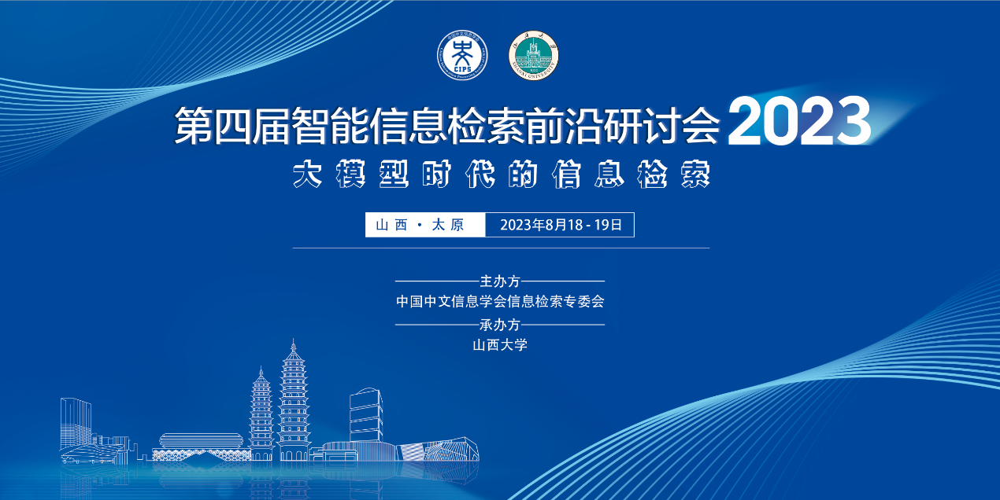
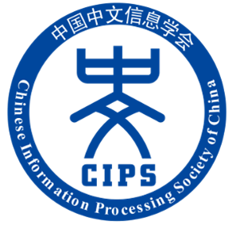
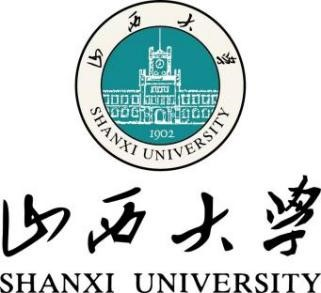









<h1 style="text-align: center">首页</h1>

<h2 style="text-align: center">第四届智能信息检索前沿研讨会（AIIR 2023）暨《大模型技术》讲习班走进山西大学</h2>

    

    &emsp;&emsp;第四届智能信息检索前沿研讨会（AIIR 2023）由中国中文信息学会信息检索专委会主办，山西大学承办，将于2023年8月18日至19日在山西省太原市山西龙城国际饭店举行，会议将采取线下与线上相结合的模式开展。会前同期举行的《大模型技术》讲习班走进山西大学（时间：8月18日14:30-18:05，地点：山西大学（坞城校区）会议中心）也向感兴趣的老师、同学免费开放。

    &emsp;&emsp;在人工智能与互联网大数据双重背景下，信息检索技术被广泛应用于各类信息获取场景，包括互联网搜索、推荐、智能问答等应用场景，与人们的生活息息相关，服务于用户的各类信息需求。自2020年起，中国中文信息学会信息检索专委会已成功举办了三届智能信息检索前沿论坛，受到了学界和业界的广泛关注，成为分享和探讨智能信息检索领域最新研究动态与发展趋势的重要交流平台。

    &emsp;&emsp;本次会议内容包括知名学者的特邀报告、信息检索战略研讨报告发布、青年学者报告、panel等，并在会前同期举行《大模型技术》讲习班走进山西大学。会议将邀请学术界与产业界造诣颇深的专家介绍最新的研究、应用进展与思考，从不同角度碰撞思想的火花，以促进国内相关领域科研人员、从业者和学生的相互学习和共同提高，推动国内信息检索事业的蓬勃发展。我们诚挚地邀请您参加本次研讨会，一起分享探讨信息检索最新学术研究成果！热诚期待与您相聚美丽的龙城太原！

    

        
主办单位：

        
        
中国中文信息学会

    

    

        
承办单位：

        
        
山西大学

    



