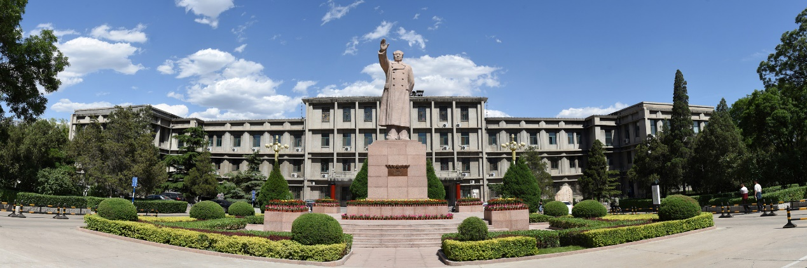

<h1 style="text-align: center;">会议组织</h1>

    
会议主席：

    
兰艳艳（清华大学）

    
张虎（山西大学）

    
程序委员会主席：

    
何向南（中国科学技术大学）

    
张鹏（天津大学）

    
王智强（山西大学）

    
宣传主席：

    
白婷（北京邮电大学）

    
马为之（清华大学）

    
财务主席：

    
艾清遥（清华大学）

    
王元龙（山西大学）

    
本地主席：

    
郑建兴（山西大学）

    
彭甫镕（山西大学）

    
廖建（山西大学）

