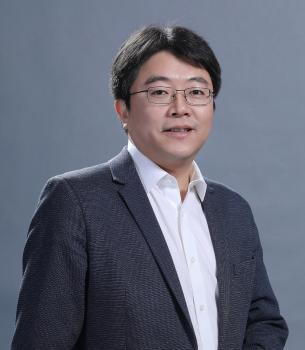
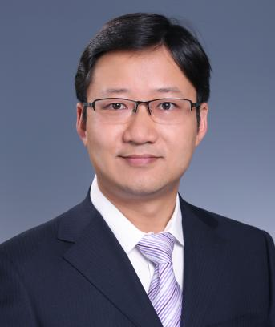
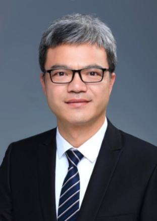
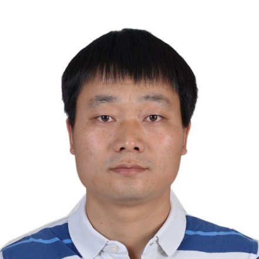

<h1>AIIR2023 邀请报告</h1>

时间：8月19日08:30-18:00，地点：龙城国际饭店·三层国会厅

特邀报告一（8月19日，8:50-9:35）

    
    
报告人：文继荣

    
文继荣，教授，现任中国人民大学信息学院院长、高瓴人工智能学院执行院长。长期从事大数据和人工智能领域的研究工作，担任国际会议SIGIR 2020程序委员会主席、国际期刊ACM TOIS和IEEE TKDE编委等。曾任微软亚洲研究院高级研究员和互联网搜索与挖掘组主任。到中国人民大学工作后，积极致力于推动人工智能和大数据的研究和教学，特别是新技术与相关学科的交叉。2013年入选国家“海外高层次人才计划”特聘专家，2018年入选首批“北京市卓越青年科学家”。

    
报告题目：检索增强的大语言模型

    
报告简介：ChatGPT为代表的大语言模型在近年来引起了极大的关注，代表了人工智能在语言理解、知识表示、逻辑推理等能力上的重大突破。受此影响，和很多其它领域一样，信息检索也正在跨入“大模型时代”，以New Bing为代表的新一代生成式检索范式正在形成，以缓和生成结果的幻觉和实时性等问题。然而这种“检索+生成”的松耦合结合方式存在很多问题，如何构建原生的、无缝结合检索与生成的大模型是一个重要的开放问题。

特邀报告二（8月19日，10:05-10:50）

    
    
报告人：刘群

    
刘群，博士，教授，ACL Fellow，华为诺亚方舟实验室语音语义首席科学家，负责语音和自然语言处理研究。原爱尔兰都柏林城市大学教授、爱尔兰ADAPT中心自然语言处理主题负责人、中国科学院计算技术研究所研究员、自然语言处理研究组负责人。分别在中国科学技术大学、中科院计算所、北京大学获得计算机学士、硕士和博士学位。主要研究方向是自然语言处理。研究成果包括汉语词语切分和词性标注系统、统计和神经机器翻译、预训练语言模型、问答和对话系统等。在专业会议和期刊上发表的论文被引用14000多次。培养国内外博士硕士毕业生50多人。获得过Google Research Award（2012）、ACL Best Long Paper（2018）、钱伟长中文信息处理科学技术奖一等奖（2010）、国家科技进步二等奖（2015）等奖项。

    
报告题目：融合搜索和工具调用的大语言模型

    
报告简介：以ChatGPT为代表的大语言模型（LLM）已经显示出强大的语言理解、生成和对话能力，但在事实性、时效性和复杂推理方面，大语言模型还存在比较严重的缺陷。另外，如何把大语言模型应用到各行各业，把各领域专业知识和语言模型有效结合起来，依然亟待探索。结合外部搜索引擎和工具调用是解决上述问题的有效方法。本报告主要介绍知识增强的语言模型的技术和研究进展，主要包括结合搜索大语言模型的和结合工具调用的大语言模型两方面内容。

特邀报告三（8月19日，10:50-11:35）

    
    
报告人：汪小我

    
汪小我，博士，清华大学长聘教授。分别于2003年和2008年在清华大学自动化系获学士和博士学位，并曾赴美国冷泉港实验室和加州大学伯克利分校访问学习。主要从事机器学习与生物信息学研究，研究兴趣包括基因组学数据挖掘、基因调控网络建模、人工基因调控元件的智能化设计等。曾担任中国生物工程学会青工委首创主任、中国人工智能学会生物信息学与人工生命专委会副主任等；获全国优秀博士学位论文奖、中国自动化学会青年科学家奖等，并获得国家杰出青年基金、国自然原创探索计划项目等项目支持。

    
报告题目：基因调控的智能解读与逆向设计

    
报告简介：随着基因测序和对基因调控规律的深入理解，下一步能否从我们需要的生物功能和表型性状出发，“逆向”设计和构造人工生物系统？要实现这一目标，如何破解DNA序列-功能之间的复杂映射关系是其中的关键。我们尝试利用人工智能强大的归纳与学习能力，一方面，发展神经网络的解释方法尝试打开模型“黑盒”，通过神经网络的学习和解析从海量基因型和表型数据中挖掘可理解的结构化知识；另一方面，构建了知识数据融合的生成式AI模型，高效探索基因调控元件遗传编码的庞大空间，进而利用合成生物技术评估模型设计结果，实现对模型的反馈与优化。通过在物理-虚拟-物理世界的循环迭代，加深对基因调控规律的认识，并获得按需定制的全新DNA序列元件，有望为开发人工基因系统用于基因治疗或细胞工厂构建提供新的潜在解决方案。

信息检索战略研讨报告发布（8月19日，14:00-14:30）

    
    
报告人：刘奕群

    
刘奕群，男，汉族，1981年1月生，中共党员，现任清华大学计算机系教授、科研院院长。主要从事信息检索、自然语言处理领域的研究工作。承担国家重点研发计划、自然科学基金重点项目等重要科研任务，相关成果在多个互联网搜索引擎和最高人民法院司法公开平台等发挥重要作用。获得本领域重要国际学术会议的8项最佳论文奖项，并获得20余项专利授权。作为第一完成人获得北京市科学技术奖一等奖、钱伟长中文信息处理科学技术奖一等奖。先后获得国家级科技创新领军人才、自然基金委优秀青年基金、国际计算机学会和中国计算机学会杰出会员称号。目前担任中国中文信息处理学会信息检索专委会主任、中国人工智能学会副秘书长、国际知名期刊《Foundations and Trends in IR》主编。

    
报告题目：信息检索战略研讨报告发布

    
报告简介：随着通用人工智能、大语言模型（LLM）等技术的快速发展，信息检索研究面临着崭新的发展机遇与挑战。为了深入探讨LLM影响下的信息检索研究新范式和应用新场景，重新思考信息检索对于人类信息认知行为的独特价值，中国中文信息学会信息检索专委会于2023年4月14-15日在山东青岛组织了战略研讨会，围绕“大模型时代的信息检索”开展了广泛而深入的讨论。会后，与会人员根据讨论情况和相关调研分析结果撰写了题为“Information Retrieval Meets Large Language Models: A Strategic Report from Chinese IR Community”（大模型时代的信息检索：来自中国信息检索研究者的战略思考）的研究报告。我将介绍本报告的主要内容，并与参会人员共同就如何凝聚学术界和产业界力量，推进我国信息检索技术研究取得更大进步开展讨论。

青年报告一（8月19日，14:30-14:55）

    
    
报告人：车万翔

    
车万翔，哈尔滨工业大学计算学部长聘教授/博士生导师，人工智能研究院副院长，云孚科技首席科学家，国家级青年人才，龙江学者“青年学者”，斯坦福大学访问学者。现任中国中文信息学会理事、计算语言学专业委员会副主任兼秘书长；国际计算语言学学会亚太分会（AACL）执委兼秘书长。目前承担国家自然科学基金重点项目、2030“新一代人工智能”重大项目课题等多项科研项目。著有《自然语言处理：基于预训练模型的方法》一书。曾获 AAAI 2013 最佳论文提名奖。负责研发的语言技术平台（LTP）已授权给百度、腾讯、华为等公司付费使用。2016 年获黑龙江省科技进步一等奖（排名第 2），2020 年获黑龙江省青年科技奖。

    
报告题目：大语言模型的原理、实现及应用

    
报告简介：随着以ChatGPT为代表的大语言模型（LLM）在语言理解、生成以及知识推理等方面表现出的惊艳能力，使人们看到了解决自然语言处理这一认知智能核心问题的一条可能的路径，并被认为向通用人工智能目标迈出了坚实的一步，甚至将取代很多人类的工作。那么，大模型究竟解决了什么科学问题，是如何解决该问题的，又是如何应用于各个领域和行业呢？本报告将通过我们的分析以及在相关领域对大模型的应用实践，部分回答以上的问题。

青年报告二（8月19日，14:55-15:20）

    
    
报告人：曹朝

    
曹朝，博士，华为泊松实验室主任，华为搜索技术工作组组长。加入华为前于北京理工大学任副教授，先后在惠普研究院、IBM研究院担任资深研究员。2004年和2010年于北京理工大学获得学士和博士学位。研究兴趣包括搜索、推荐、分布式系统、大数据等方向。中国中文信息学会信息检索专委会委员，CCF区块链专业委员会常务委员、数据库专业委员会委员。

    
报告题目：提示引擎：基于大模型的搜索推荐技术

    
报告简介：大语言模型为搜索推荐提供了一种更自然的交互方式，也为搜索推荐技术发展注入了新的动能，如何合理有效的使用大模型成为一个热点问题。本报告的主要内容包括：（1）驱动大模型有效工作的关键因素探索，介绍信息输入的充分性、必要性、形式清晰性等；（2）从系统设计、测试、运行、升级等阶段介绍大模型应用中间件提示引擎要解决的关键问题和实践经验。

青年报告三（8月19日，15:40-16:05）

    
    
报告人：冯福利

    
冯福利，中国科学技术大学特任教授，入选国家青年人才计划。研究领域：信息检索、数据挖掘、机器学习、因果推断等，承担推荐算法合规、监管相关国家级项目，发表国内外顶级会议和期刊论文近100篇，谷歌学术引用6000余次，研究成果在多家公司的商业系统应用。曾获SIGIR 2021最佳论文提名奖、WWW 2018最佳演示论文奖。

    
报告题目：大模型推荐技术及展望

    
报告简介：以GPT为代表的大语言模型（LLM）展示了惊人的新兴理解、推理和规划能力，催生了将LLM应用于推荐系统以提升性能和用户体验的有前景的研究方向。报告介绍大模型推荐技术的进展，包括如何教会LLM做推荐：1）基于in-context learning的LLM推荐能力激发，2）基于instruct- tuning的LLM推荐任务对齐；以及如何利用LLM推动推荐范式革新：3）基于LLM的生成式召回，4）基于LLM的生成式推荐。报告进一步讨论大模型推荐带来的机遇与挑战。

青年报告四（8月19日，16:05-16:30）

    
    
报告人：张永锋

    
张永锋，罗格斯大学计算机系助理教授、博导，互联网智能与经济实验室主任，研究兴趣包括机器学习、机器推理、信息检索、推荐系统、自然语言处理、人工智能的可解释性与公平性、人工智能伦理等，研究成果发表于SIGIR, WWW, RecSys, ACL, NAACL, CIKM, WSDM, AAAI, IJCAI, TOIS等领域内主要会议或期刊。担任期刊ACM Transactions on Information Systems、ACM Transactions on Recommender Systems和Frontiers in Big Data副主编。曾获得AIRS最佳论文奖、ACM TOIS杰出编辑奖、美国自然科学基金杰出青年奖（NSF CAREER Award）。

    
报告题目：Generative Recommendation with Foundation Models

    
报告简介：The boom of Generative AI driven by Foundation Models has brought a paradigm shift for recommender systems. Instead of traditional multi-stage matching-based recommender systems that have to calculate user’s ranking score with each candidate item one-by-one, it now becomes possible to do straightforward single-stage recommendation by directly generating the recommended items based on user’s personalized inputs. This paradigm shift not only brings increased recommendation accuracy, but also improves the efficiency through single-stage recommendation, and enables better controllability for users based on natural language prompts. This talk with introduce generative recommendation from various perspectives, including foundation models for recommendation, item representation, multi-modality recommendation, prompt generation, as well as the explainability and fairness of foundation models for recommendation.

