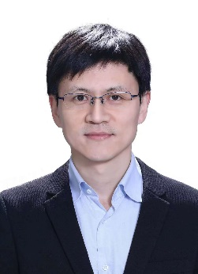

<h1>《大模型技术》讲习班走进山西大学</h1>

时间：8月18日14:30-18:05，地点：山西大学（坞城校区）·会议中心

专题讲座一（8月18日，14:50-15:25）

    
    
报告人：赵鑫

    
赵鑫，现为中国人民大学高瓴人工智能学院教授。2014年7月于北京大学获得博士学位，随后进入中国人民大学工作至今。研究领域为信息检索与自然语言处理，共计发表论文100余篇，曾主导研发了伯乐（推荐系统库RecBole）、妙笔（文本生成库TextBox）等开源工具。荣获2020年吴文俊人工智能优秀青年奖、ECIR 2021时间检验奖（Test of Time Award）、RecSys 2022最佳学生论文提名（Best student paper runner-up）、CIKM 2022最近资源论文提名（Best resource paper runnerup）等，入选中国科协青年人才托举工程、北京智源青年科学家、CCF-IEEE CS青年科学家。

    
报告题目：ChatGPT发展历程与关键技术

    
报告简介：最近，以ChatGPT为代表的大语言模型受到了社会的广泛关注。本次报告将围绕ChatGPT的发展历程以及相关研究背景展开，将介绍GPT系列模型的发展历程（包括GPT-1/2/3、CodeX、ChatGPT以及GPT-4等），同时概要介绍大模型的主要能力特点和相关技术（指令微调、人类对齐、情境学习、思维链等），以及大模型对于人工智能发展所带来的的潜在影响。

专题讲座二（8月18日，15:25-16:00）

    
    
报告人：刘知远

    
刘知远，清华大学计算机系副教授、博士生导师。主要研究方向为自然语言处理、基础模型。2011年获得清华大学博士学位，已在ACL、EMNLP、IJCAI、AAAI等人工智能领域的著名国际期刊和会议发表相关论文200余篇，Google Scholar统计引用超过3.3万次。曾获教育部自然科学一等奖（第2完成人）、中国中文信息学会钱伟长中文信息处理科学技术奖一等奖（第2完成人）、中国中文信息学会汉王青年创新奖，入选国家青年人才项目、北京智源研究院青年科学家、2020-2022连续三年Elsevier中国高被引学者、《麻省理工科技评论》中国区35岁以下科技创新35人榜单、中国科协青年人才托举工程。担任中文信息学会理事、社会媒体处理专委会副主任，期刊AI Open副主编，ACL、EMNLP、WWW、CIKM、COLING等国际著名会议领域主席。

    
报告题目：大模型值得关注的重要特性

    
报告简介：近年来以BERT、GPT为代表的预训练模型，使人工智能技术进入“预训练-微调”的全新范式，特别是最近ChatGPT引爆了全社会对大模型技术的关注。本报告重点介绍大模型与过去深度学习模型相比，在模型框架、微调适配以及推理计算等方面的重要特性，探讨大模型未来的研发应用范式。

专题讲座三（8月18日，16:20-16:55）

    
    
报告人：张岳

    
张岳， 西湖大学教授。本科毕业于清华大学，硕博毕业于牛津大学。主要研究领域为自然语言处理、文本挖掘及相关的机器学习方法。研究成果包括自左向右处理文本的结构预测算法、多任务融合学习的联合模型、文本表示神经网络和图神经网络的创新算法、自然语言处理和人类常识研究。著有剑桥大学出版社《自然语言处理——机器学习视角》，编写牛津参考文献自然语言处理。担任国内外顶级会议CCL 2020、EMNLP 2022程序委员会共同主席，担任transactions of ACL执行编辑，IEEE TBD、IEEE TASLP、ACM TALLIP副主编。

    
报告题目：大模型推理和泛化研究

    
报告简介：ChatGPT 代表自然语言处理的最新发展水平，引起了众多社会关注，带来了很多变革机遇。与此同时，大模型也存在一系列内在挑战，包括能源损耗，事实错误，推理问题等。在这次报告中，在这次报告中，我将从语言推理开始，介绍大模型逻辑推理能力的定量研究。在此基础之上，我将讨论一个更本质的问题，关键解题思路的学习。我将从因果特征的角度，讨论模型的分布外泛化问题，并且给出一些简单解决思路。

专题讲座四（8月18日，16:55-17:30）

    
    
报告人：陈旭

    
陈旭，博士毕业于清华大学，于2020年加入中国人民大学，任准聘助理教授。他的研究方向为推荐系统，强化学习，因果推断等。曾在TheWebConf、AIJ、TKDE、SIGIR、WSDM、TOIS等著名国际会议/期刊发表论文60余篇。曾共同主导构建推荐系统工具包“伯乐”，可解释推荐数据集REASONER，以及基于大语言模型的推荐用户自主智能体仿真环境RecAgent等。他的研究成果曾获得TheWebConf 2018最佳论文提名奖、CIKM 2022 最佳资源论文Runner Up 奖和AIRS 2017最佳论文奖。同时，他也曾荣获CCF自然科学二等奖（排名第二），ACM-北京新星奖（北京市三人）等。他的研究成果在多家企业落地，相关成果荣获华为“创新先锋”总裁奖。他主持/参与多项国家自然科学基金以及企业合作项目。

    
报告题目：基于大语言模型的自主智能体构建与应用

    
报告简介：近年来，以Generative Agent为代表的基于大语言模型的智能体研究吸引了科研人员的广泛关注。本次报告围绕基于大语言模型的智能体构建，应用和评价展开，概要介绍利用大语言模型构建通用和领域专用智能体的关键技术，分析该领域的现存挑战，并展望未来的发展方向。

专题讲座五（8月18日，17:30-18:05）

    
    
报告人：毛先领

    
毛先领，北京理工大学副教授，博导。主要研究信息检索与数据挖掘。目前担任计算机学会中文信息技术专委会委员、中文信息学会青工委执委以及语言与知识专委会委员；已在SIGIR、WWW、SIGMOD、ACL、TOIS、TKDE等国际期刊会议上发表50余篇论文；部分成果获3项省部级科技进步奖。

    
报告题目：科技大模型“墨子”及其学术应用

    
报告简介：科学技术是生产力发展的核心动力，承载人类最前沿科技知识的论文数据也正在指数级快速增长。围绕海量科技数据与研究人员有限时间之间的矛盾，课题组研发了科技大模型“墨子”，并将其应用于前期研发的跨模态科技搜索引擎、科技知识图谱、科技论文阅读器和科技对话系统等学术产品中，希冀提升科研工作者的科研效率。

