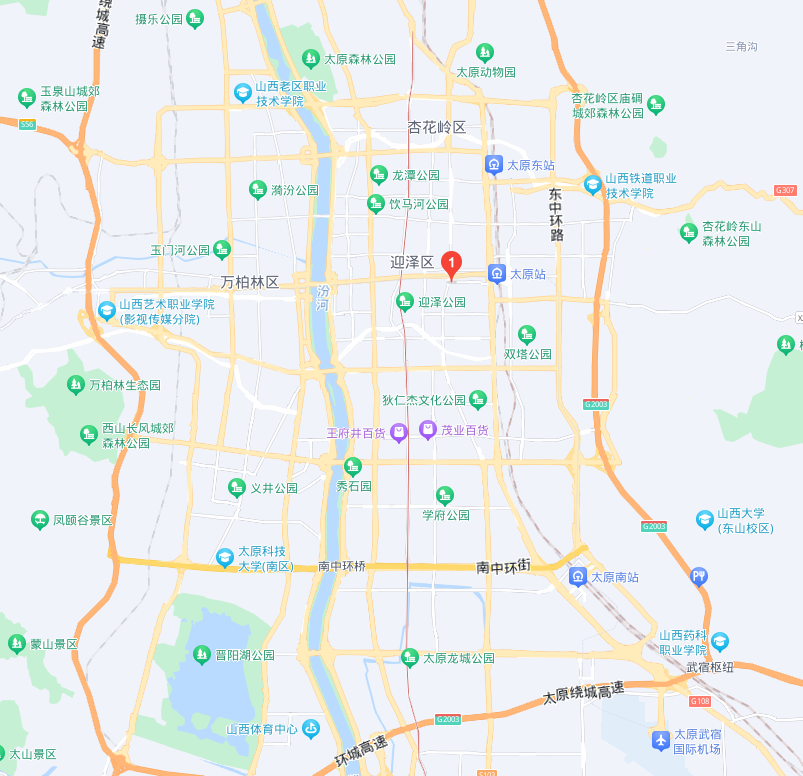









<h1 style="font-family: Times New Roman,'宋体',serif;text-align: center;font-weight: bold">住宿交通</h1>

    
一、住宿酒店

    
&emsp;&emsp;山西太原龙城国际饭店（山西省太原市迎泽区并州北路2号）

    

        &emsp;&emsp;协议价：
        标间420元/晚（含双早）；大床450元/晚（含双早）
    

    

        &emsp;&emsp;注：
        预定房间，需在会议注册页面扫描并填写回执二维码（含住宿信息），会务组为参会代表提前预留房间。下图中红色1标注位置即为住宿酒店。
    

    

        
    

    
二、交通路线

    <table style="font-family: Times New Roman,'微软雅黑',serif;text-align: left;border: 1px solid #000;border-collapse: collapse;margin: 0 auto;width: 80%">
        <thead>
        <tr style="font-size: x-large;text-align: center">
            <th style="border: 1px solid;border-collapse: collapse;background-color: #4f80bc;color: white;">太原各站到酒店</th>
            <th style="border: 1px solid;border-collapse: collapse;background-color: #4f80bc;color: white">出行方式</th>
            <th style="border: 1px solid;border-collapse: collapse;background-color: #4f80bc;color: white">具体路线</th>
        </tr>
        </thead>
        <tbody>
        <tr>
            <th rowspan="2" style="border: 1px solid;border-collapse: collapse;text-align: center;vertical-align: middle">
                武宿机场
            </th>
            <th style="border: 1px solid;border-collapse: collapse;">出租车</th>
            <th style="border: 1px solid;border-collapse: collapse;">从机场出发乘坐出租车达到酒店，约16公里（约25分钟）。</th>
        </tr>
        <tr>
            <th style="border: 1px solid;border-collapse: collapse;">公交车</th>
            <th style="border: 1px solid;border-collapse: collapse;">在机场航站楼公交站处乘坐201路公交车（前往火车站方向，乘坐20站），在广场站处下车。（全程约1小时23分）</th>
        </tr>
        <tr>
            <th rowspan="2" style="border: 1px solid;border-collapse: collapse;text-align: center;vertical-align: middle">太原南站
            </th>
            <th style="border: 1px solid;border-collapse: collapse;">出租车</th>
            <th style="border: 1px solid;border-collapse: collapse;">打车约11.5公里（全程约21分钟）</th>
        </tr>
        <tr>
            <th style="border: 1px solid;border-collapse: collapse;">公交车</th>
            <th style="border: 1px solid;border-collapse: collapse;">在火车南站公车站乘坐 901路支/11路/201路/902路/（火车站方向，推荐901路支），在广场站下车。（全程约39分钟）。</th>
        </tr>
        <tr>
            <th rowspan="2" style="border: 1px solid;border-collapse: collapse;text-align: center;vertical-align: middle">太原站
            </th>
            <th style="border: 1px solid;border-collapse: collapse;">出租车</th>
            <th style="border: 1px solid;border-collapse: collapse;">打车2.3公里达到会议酒店。（全程约10分钟）</th>
        </tr>
        <tr>
            <th style="border: 1px solid;border-collapse: collapse;">公交车</th>
            <th style="border: 1px solid;border-collapse: collapse;">在火车站（东广场）公交站乘坐870路（开往化章西街口方向，乘坐两站），在广场站处下车。（全程约24分钟）</th>
        </tr>
        </tbody>
    </table>



