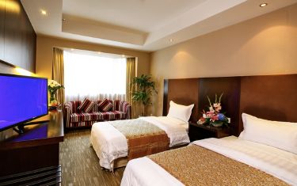
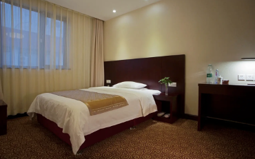
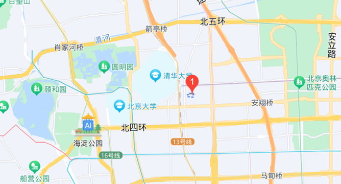









# <i class="fas fa-feather-alt"></i>住宿交通

1. 住宿酒店

   北京市西郊宾馆（北京市海淀区王庄路 18 号）
   协议价： 标准间 480 元/晚（不含早）；大床房 460 元/晚（不含早），早餐 60/人。
   
  

   下图中红色 1 标注位置即为住宿酒店。

   

   

   注：预定房间，需在会议注册页面扫描并填写回执表发送至邮箱ccir2023@126.com（含住宿信息），会务组为参会代表提前预留房间。

2. 交通情况

   距离首都国际机场 T3 航站楼，32 公里，50 分钟车程，高峰预计 1.5-2 小时；地铁约 70 分钟；

   距离大兴国际机场，60 公里，80 分钟车程，高峰预计 2-2.5 小时；地铁约 90 分钟（需出站换乘）；

   距离北京西站，16 公里，40 分种车程，高峰预计 70-90 分钟；地铁约 60 分钟。

   距离北京南站，21 公里，50 分钟车程，高峰预计 80-100 分钟；地铁约 60 分钟。

   距离北京站， 22 公里，50 分钟车程，高峰预计 80-100 分钟；地铁约 60 分钟。



