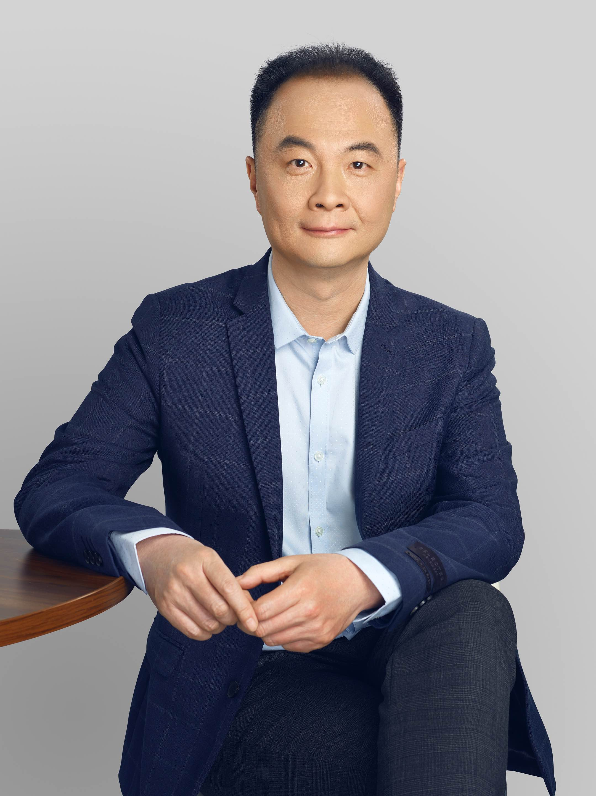
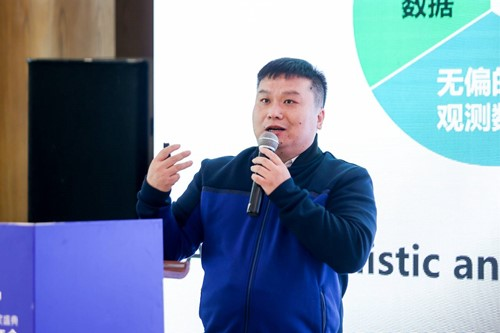
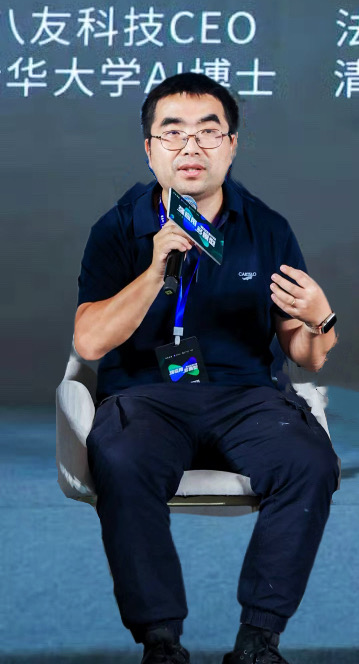
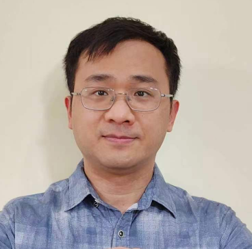









# **主旨报告**

### **报告一：AI⼤模型时代--新的机遇与挑战**
**报告人**：李航（字节跳动）[下载报告 ppt](./assets/keynote-lihang.pdf)

**个人介绍**： 李航，字节跳动科技有限公司研究部门负责⼈。ACM Fellow、ACL Fellow，IEEE Fellow。京都⼤学毕业，东京⼤学博⼠。曾就职于NEC公司中央研究所，微软亚洲研究院，华为技术有限公司诺亚⽅⾈实验室。主要研究⽅向⾃然语⾔处理、信息检索、机器学习、数据挖掘。

**报告摘要**： ChatGPT 的问世揭开了⼈⼯智能历史的新篇章，也孕育着⼈们未来⽣活和⼯作的巨⼤变化。在这个报告中，我将介绍⾃⼰对 AI ⼤模型，特别是语⾔⼤模型的观察和思考。总结语⾔⼤模型技术的特点，介绍⾃⼰对⾯向未来的⼀些研究课题的看法。重点讨论语⾔⼤模型与⼼智语⾔，语⾔⼤模型与多模态处理、语⾔⼤模型与逻辑推理等问题。AI ⼤模型的新时代开始了，我们需要在已有⼯作的基础上，定义新问题，研究新⽅法，开发新技术，开启 AI 研究的新征程。

### **报告二：Large Language Models for Information Retrieval: Opportunities and Challenges**
**报告人**：翟成祥（美国伊利诺伊大学香槟分校）[下载报告 ppt](./assets/keynote-zhai.pptx)

**个人介绍**： ChengXiang Zhai (http://czhai.cs.illinois.edu) is a Donald Biggar Willett Professor in Engineering of the Department of Computer Science at the University of Illinois at Urbana-Champaign (UIUC), where he is also affiliated with School of Information Sciences, Department of Statistics, and the Carl R. Woese Institute for Genomic Biology. He received a Ph.D. in Computer Science from Nanjing University in 1990, and a Ph.D. in Language and Information Technologies from Carnegie Mellon University in 2002. He worked at Clairvoyance Corp. as a Research Scientist and a Senior Research Scientist from 1997 to 2000. The general goal of his research is to build intelligent systems to leverage big data, especially big text data, to augment human intelligence and support complex user tasks in many domains such as healthcare, education, and scientific discovery. His specific research interests include intelligent task agents, computational models of users, human-like natural language processing, and intelligent infrastructure for human-AI collaboration. He has over 400 publications in these areas with over 40,000 citations and an h-index of 92 in Google Scholar. He holds 5 US patents. He is America Editor of the Springer Information Retrieval Book Series and a Senior Associate Editor of ACM Transactions on Intelligent Systems and Technology. He served as a program co-chair of ACM SIGIR'09, WWW'15, and  as a conference co-chair of CIKM'16, WSDM'18, and IEEE BigData'20. He is an ACM Fellow and a member of the ACM SIGIR Academy, and received numerous awards, such as ACM SIGIR Gerard Salton Award, ACM SIGIR Test of Time Award (three times), the 2004 Presidential Early Career Award for Scientists and Engineers (PECASE), Alfred P. Sloan Research Fellowship, IBM Faculty Award, HP Innovation Research Award , UIUC Rose Award for Teaching Excellence, and UIUC Campus Award for Excellence in Graduate Student Mentoring. He has graduated 41 PhD students and over 50 MS students.

**报告摘要**： Recent years have seen great success of large language models (LLMs) in performing many natural language processing tasks with impressive performance, especially tasks that directly serve users such as question answering and text summarization. While statistical language models have been applied to information retrieval since many decades ago, these new large language models go far beyond traditional language models in their representation learning capacity, which enabled them to both understand natural language semantically and generate fluent meaningful natural language text. As such, they open up unprecedented opportunities for transforming information retrieval research and applications. However, concerns such as hallucination undermine their trustworthiness, limiting their actual utility when deployed in real-world applications, especially high-stake applications where trust is vital. In this talk, I will systematically examine the opportunities and challenges that LLMs have created for information retrieval research and applications. Specifically, I will address the following questions: 1) How can LLMs be leveraged to improve the current search engines? 2) What is the potential for LLMs to transform the future information retrieval applications? 3) What are the major challenges in applying LLMs to information retrieval? 4) Given the anticipated growth of LLMs, what will future information retrieval systems look like?  

# **主题报告**

### **报告一：工业界推荐系统十大挑战问题**
**报告人**：董振华（华为诺亚方舟实验室）[下载报告 ppt](./assets/keynote-dongzhenghua.pptx)

**个人介绍**： 董振华博士是华为诺亚方舟实验室技术专家、项目经理，其目前的研究兴趣是推荐系统、因果推断、信息检索及机器学习应用。他所领导的研究团队将推荐系统、机器学习、因果推断等技术落地于应用市场、信息流、广告、即时服务、音乐、视频等多个产品，显著提升业务效果。基于以上实际的场景和数据，董振华博士申请了超过40项专利，并在TKDE，TOIS，TORS，SIGIR，RecSys，KDD，WEB，AAAI，CIKM等期刊、会议发表推荐系统、信息检索、因果推断相关论文60余篇，并有译著中文版《奇点临近》。他还做为RecSys24 industry chair, RecSys22/23 sponsor chair， PC，SPC服务于RecSys，SIGKDD，SIGIR，WSDM，CIKM等研究社区。董振华博士本科毕业于天津大学，博士毕业于南开大学，期间在明尼苏达大学GroupLens实验室作为访问学者交流学习1年。

**报告摘要**： 从2013年开始，华为诺亚方舟实验室帮助很多产品构建推荐系统和搜索引擎，帮助用户在合适的时间、地点、场景获取满足其个性化需求的信息、服务。我们的推荐系统每天都为数以亿计的用户提供新闻、歌曲、视频、图书、应用、主题壁纸等个性化内容服务。海量的数据和多元的场景也为我们提供了研究前沿推荐系统技术的机会。与此同时，我们也见证了推荐系统过去10年的技术趋势：从简单、浅层的协同过滤、线性模型、低秩模型到复杂、深层的神经网络、预训练模型。基于以上使命、机会和技术趋势，我们在推荐系统的研究和落地过程中发现了很多非常难的问题。在本次演讲中，我们将分享10个重要、有趣的推荐系统挑战难题，并期望有机会与推荐系统研究社区的同仁一起合作，解决以上难题，创建更好的推荐系统。

### **报告二：大模型的发展与技术思考**
**报告人**：王小川（百川智能）

**个人介绍**： 王小川，百川智能创始人兼CEO ，清华大学计算机科学与技术专业工程博士，清华大学天工智能计算研究院联席院长。高中时期用吴文俊消元法，首次在微型机下完成初等几何命题的全部证明。曾获国际信息学奥林匹克竞赛（IOI）金牌、北京市科学技术奖一等奖、中国青年科技奖、中国电子学会科学技术奖科技进步奖一等奖、钱伟长中文信息处理科学技术一等奖。

**报告摘要**： 大模型正引领我们走进智能时代，其引发的变革将超越工业革命、电力革命和信息革命所引起的变革总和。大模型就像互联网时代提供信息化基础的芯片一样，会在社会各个方面“点亮智能”。语言模型是AGI的起点，因为大模型将语言变成数学模型，掌握了语言背后的知识、思考、沟通和文化，大模型不仅将重塑现有行业，更将创造全新价值。虽然大模型展现出了强大的通用性和泛化能力，但现在的大模型还有很多不足，比如幻觉问题、时效性问题、安全问题等。其中很多问题可以通过搜索技术来解决。搜索技术不仅可以从超大规模数据获取和清洗、算法与工程优化等方面助力大模型研发，还能够减少幻觉的生成，有效提升模型的时效性、安全性。

# **工业论坛报告**

### **报告一：大模型中文语料的采集\使用和风险**
**报告人**：梁斌，八友科技 [下载报告 ppt](./assets/industry-liangbin.pptx)

**报告摘要**： 大模型在2023年2月底在中国飞速发展，短短半年时间内涌现出了超过100家大模型团队，我们通过8年数据采集工作的积累服务了其中的50多家，并拜访了其中大部分团队，在服务过程中，加深理解了大模型团队在数据方面的需求和使用方法。通过本报告主要介绍关于大模型数据的采集，使用极其整个过程涉及的红线和风险。

### **报告二：大语言模型在现代搜索引擎中的应用**
**报告人**：王帅强，百度  [下载报告 ppt](./assets/industry-baidu.pdf)

**报告摘要**：近年来，基于预训练的大语言模型目前已经成为自然语言处理和人工智能等领域最令人瞩目的研究方向，并且在学术界和工业界都引发了广泛的关注。现代搜索引擎是自然语言处理和人工智能技术最重要的应用场景，大语言模型已经在当前的搜索系统迭代和产品优化中大规模落地，并大幅提升了搜索效果。本报告将具体介绍大语言模型在现代商用搜索引擎不同阶段中的一系列相关应用和探索，最后探讨未来大语言模型在信息检索领域值得关注的研究和应用方向。

### **报告三：原子大模型，从通才迈向专才**
**报告人**：张俊祺，原子回声 

**报告摘要**：原子大模型由原子回声自主研发，包括Atom-1B、Atom-7B和Atom-13B三个通用基础模型，在语言理解、文本生成、任务执行等方面达到国内先进水平。同时构建了智能体标准化定制平台AtomHub，基于个人和企业的专有知识库，通过检索增强与知识注入等技术实现模型快速定制，让每位用户都可以拥有自己的专才大模型。

### **报告四：大规模类案检索系统-信息检索技术在司法场景的应用**
**报告人**：杜斟，航天国政  

**报告摘要**：类案检索对于全面准确落实司法责任制和统一法律适用具有十分重要的意义，本次报告主要介绍在一亿审判文书规模上的类案检索系统研发及效果，该系统主要特点是同时支持基于关键词和向量的检索，提出了CaseFormer模型，使得检索效果更加精准高效。

### **报告五：中国移动“弈衡”大模型评测体系研究及技术发展趋势浅析**
**报告人**：刘伟东，中国移动  [下载报告 ppt](./assets/industry-yidong.pdf)

**报告摘要**：中国移动作为国内领先的信息服务企业，为了积极致力于推进大模型技术的健康发展，我们深入开展了“弈衡”大模型评测体系研究，旨在建立全面、客观和中立的评测标准，针对业界主流的20余款大模型进行了深入的评测验证，从多维度揭示了目前主流大模型的主要挑战和发展趋势，助推大模型技术发展与产业成熟。

### **报告六：AI在短视频领域的机遇和挑战**
**报告人**：宋洋，快手 [下载报告 ppt](./assets/industry-kuaishou.pdf)

**报告摘要**：快手AI前沿技术探索及合作布局，包括快手在内容生产，内容理解，内容分发三大方面的前沿技术成果和未来规划，重点展开快手作为主流的短视频平台在推荐系统方面的挑战，实战和探索，涉及多个业界首次落地的技术方案和首次公开的工业界推荐数据集，在学术界和工业界都获得了广泛的影响力。

### **报告七：基于可视化技术的数字孪生工厂实践及探索**
**报告人**：彭海军，首亨软件 

**报告摘要**：利用自主研发的数字李生可视化应用平台，帮助烟厂、军工及智能制造场景在虚机空间创建物理世界的数字映射，并借助数、算法等手段，实现对物理世界的感知、诊断、预测释放数据价值，辅助业务决策。



