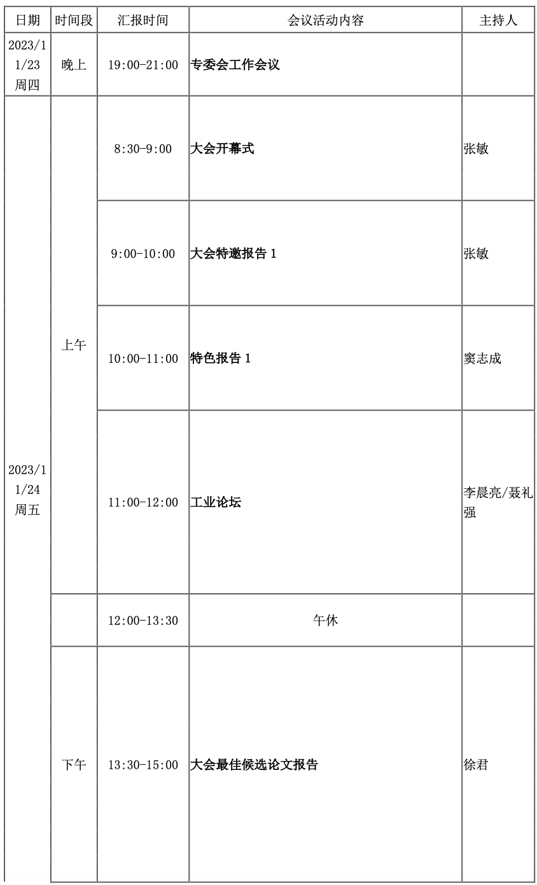
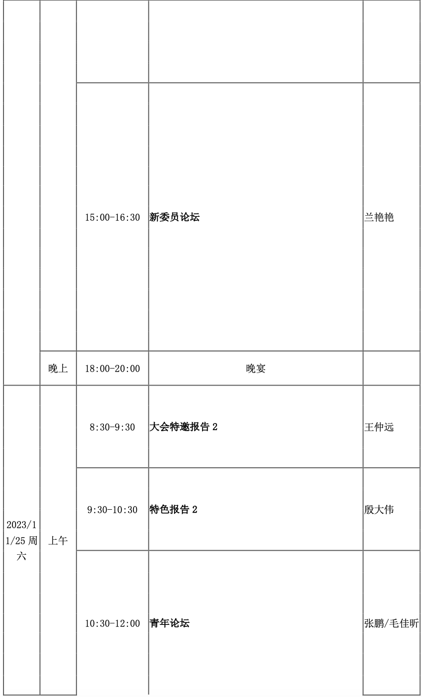
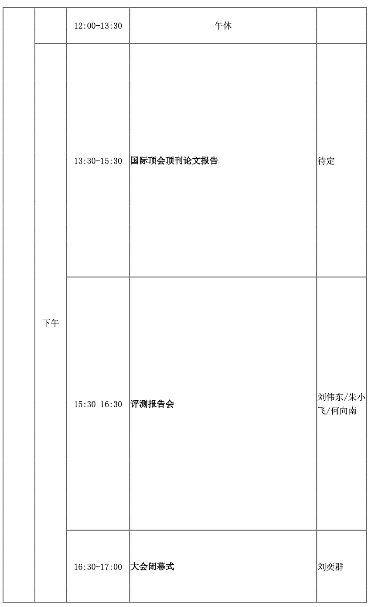
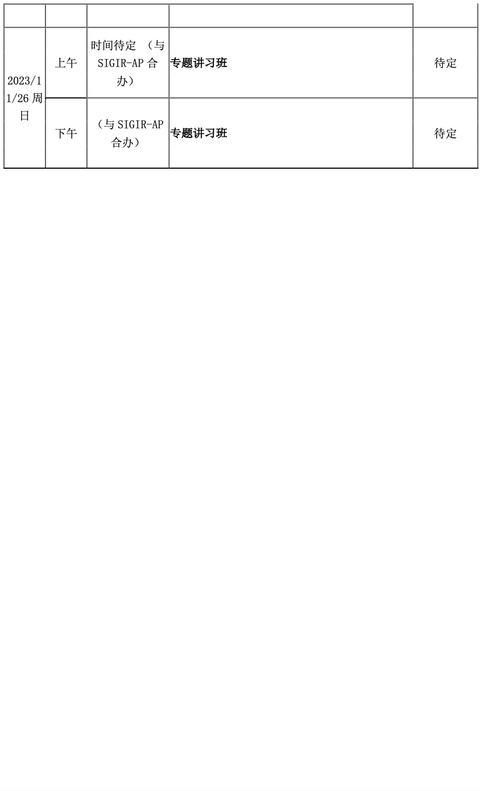
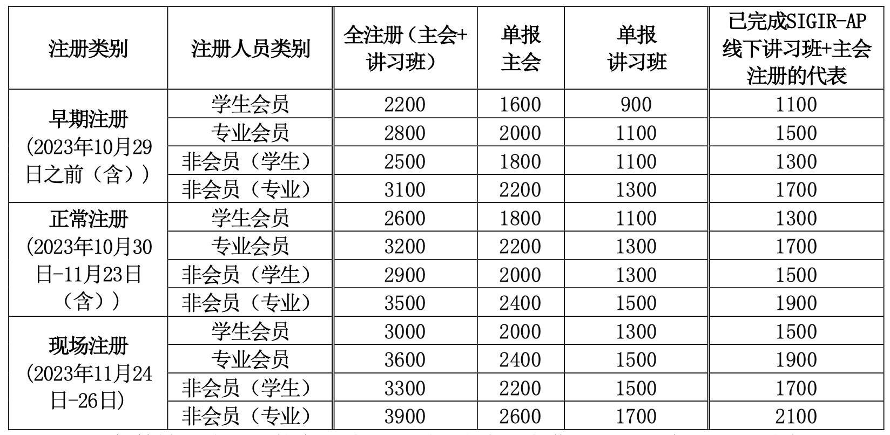
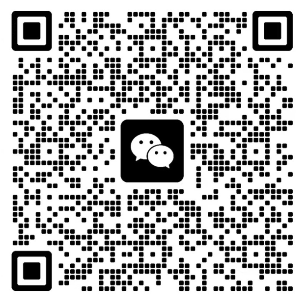









# <i class="fas fa-feather-alt"></i>会议注册

尊敬的各位会议代表，大家好！

第二十九届全国信息检索学术会议（CCIR 2023）将于 2023 年 11 月 24 日-26 日在北京市举行。会议由中国中文信息学会（CIPS）主办，由中国中文信息学会信息检索专委会、清华大学承办。作为 CIPS 的旗舰会议，CCIR 着力于中国互联网产业的发展，为信息检索领域最新学术和技术成果提供了广泛的交流平台。会议包含一系列学术活动，除传统的海内外知名学者的大会报告、会议论文报告外，还将组织青年学者论坛以及面向热点研究问题的讲习班等。CCIR 已成为全国范围内信息检索领域新学术和技术工作的主要交流平台。

会议网站：http://www.cips-ir.org.cn/CCIR2023/

现邀请大家注册参加 CCIR 2023，一起分享、共同探讨，努力促进我国中文信息检索领域的技术与产业的创新与发展。

**一、会议安排**

2023 年 11 月 24-25 日 开幕式、特邀报告、分论坛、颁奖、闭幕式

2023 年 11 月 26 日 讲习班（与 SIGIR-AP 联合举办）

会议日程暂定如下：

邀请函：即将更新

**二、会议注册费**

请访问会议注册网站完成在线注册：http://reg.cipsc.org.cn/ccir2023/index.html，会议注册过程中如有问题请联系中文信息学会邮箱cips@iscas.ac.cn。

注 1：每篇被正式录用的会议论文必须至少有一名作者注册主会议，否则论文不予发表。

注 2：“会员”指中国中文信息学会会员（CIPS）。会员费标准：学生会员 50 元/年，专业会员 200 元/年。

注 3：按照“已完成 SIGIR-AP 线下 讲习班+主会注册的代表”注册缴费的参会者，需要同时将本人的 SIGIR-AP 的注册通知发送给ccir2023@126.com以备查询。如果不满足该要求，将不被视为有效注册。

注 4：本次会议食宿费用自理，

若尚未注册 SIGIR-AP 会议但有意参加两个会议的参会代表，在 CCIR 早鸟注册期间（10 月 29 日前（含））完成 SIGIR-AP 线下讲习班+主会注册仍可享受 Early-Bird 优惠（按早鸟价缴费，http://www.sigir-ap.org/sigir-ap-2023/registration/），随后可按照“已完成SIGIR-AP线下讲习班+主会注册的代表”的优惠注册CCIR。注意必须在10月29日前（含）完成两个会议的注册，单一会议注册将无法享受优惠。如有疑问可以邮件联系CCIR组委会ccir2023@126.com或SIGIR-AP组委会registration_2023@sigir-ap.org。

请各位参会嘉宾在注册网站上完成注册后，加入 CCIR 2023 参会微信群

**三、会议住宿酒店预订**

1. 在完成会议注册后，会务组会在 1-2 天内给参会代表发送带有协议价的会议举办酒店预订二维码，参会代表可以扫码按需预定房间；
2. 参会代表亦可参见会议官网的住宿交通页面，自主选择预定会议地点附近的酒店。

**四、联系方式**

会务、住宿、交通等问题，可参见会议官网或邮件联系：ccir2023@126.com

期待与您在北京相见！

中国中文信息学会



