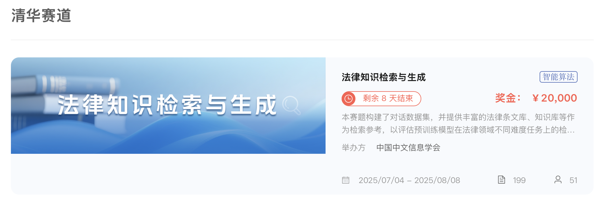
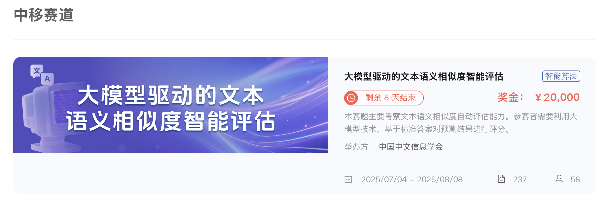

---
# TODO
title: CCIR 2025 法律知识检索与生成 大赛
# DONE
---









<!-- TODO -->

# <i class="fas fa-feather-alt"></i> CCIR CUP 2025 法律知识检索与生成大赛

全国信息检索挑战杯（CCIR Cup）是由全国信息检索学术会议（CCIR）发起的技术评测比赛。

全国信息检索学术会议（CCIR）由中国中文信息学会主办，一路伴随着中国互联网产业的成长，迄今已成功举办三十一届，是信息检索领域的旗舰会议。CCIR 旨在推动信息检索领域的发展，满足人类在互联网上快速准确地获取信息与知识的需求，支撑国家战略决策，推动互联网和人工智能领域的发展。CCIR 从 2009 年起，开始组织系列评测比赛，致力于围绕实际问题探索解决方案，并为信息检索领域科研人员提供必需的研究数据支持。

本次大赛共有<a href="https://www.xir.cn/competitions/1116">法律知识检索与生成</a>和<a href="https://www.xir.cn/competitions/1118">大模型驱动的文本语义相似度智能评估</a>两个赛题，更多信息请见<a href="https://www.xir.cn/races/ccir2025">官网</a>。

<a href="https://www.xir.cn/competitions/1118">

## 比赛时间线

- 7 月 4 日：CCIR Cup 大赛启动（发布赛题，开放报名）
- 7 月 4 日-7 月 30 日：CCIR Cup 初赛 A 榜（提交作品，实时评测）
- 7 月 30 日 24 点：停止在线提交作品
- 7 月 31 日： CCIR Cup 初赛 B 榜（提交作品，定时评测）
- 8 月 1 日-8 月 7 日：代码复现、晋级资格审核
- 8 月 8 日：决赛答辩、公布获奖名单
- 8 月 14 日-8 月 18 日：颁奖典礼

<!-- DONE -->



