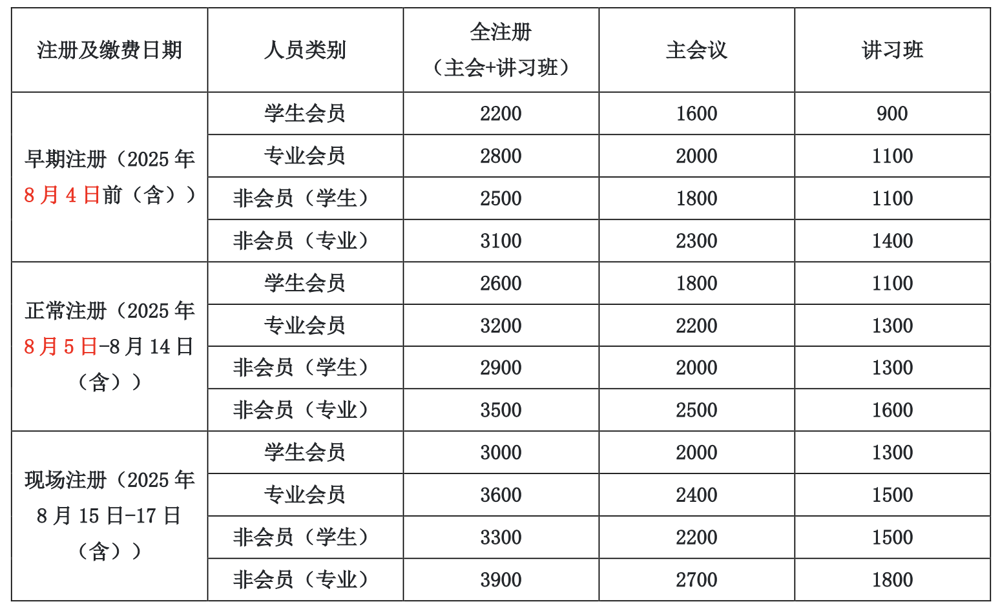









# <i class="fas fa-feather-alt"></i>会议注册

尊敬的各位会议代表，大家好！

第三十一届全国信息检索学术会议（The 31th China Conference on Information Retrieval）将于 2025 年 8 月 15 - 17 日在新疆石河子举行，由中国中文信息学会信息检索专委会主办、石河子大学承办。作为 CIPS 的旗舰会议，CCIR 着力于中国互联网产业的发展，为信息检索领域最新学术和技术成果提供了广泛的交流平台。本次大会的主题是“信息检索  智能体：新范式与新机遇”，聚焦信息检索与智能体的深度融合，建立信息获取、规划推理、群智协同与自主决策新范式。会议包含一系列学术活动，除传统的海内外知名学者的大会报告、会议论文报告外，还将组织青年学者论坛以及面向热点研究问题的讲习班等。CCIR 已成为全国范围内信息检索领域新学术和技术工作的主要交流平台。

会议网站：http://www.cips-ir.org.cn/CCIR2025/

邀请函：<a href="./assets/invitation_v1.pdf">点击下载</a>

现邀请大家注册参加 CCIR 2025，一起分享、共同探讨，努力促进我国中文信息检索领域的技术与产业的创新与发展。

**一、会议安排**

2025 年 8 月 15 日 讲习班、专委会会议

2024 年 8 月 16 - 17 日 开幕式、特邀报告、分论坛、颁奖、闭幕式

会议地点：新疆石河子市恒和华星酒店

**二、会议注册费**

请访问 <a href="https://www.cipsc.org.cn/Learn/index.aspx?itemid=4929">会议注册网站</a> 完成在线注册，会议注册过程中如有问题请联系中文信息学会邮箱 cips@iscas.ac.cn。
注册费用如下：

注 1：每篇被正式录用的会议论文必须至少有一名作者注册主会议，否则论文不予发表。

注 2：“会员”指中国中文信息学会会员（CIPS）。会员费标准：学生会员 50 元/年，专业会员 200 元/年。

注 3：本次会议食宿费用自理。

请各位参会嘉宾在注册网站上完成注册。

**三、会议住宿酒店预订**

1. 注册链接内有酒店预定及信息收集，组委会不单独提供酒店选项。
2. 参会代表亦可参见会议官网的住宿交通页面，自主选择预定会议地点附近的酒店。

**四、联系方式**

<!-- TODO -->

会务、住宿、交通等问题，可参见会议官网或邮件联系：ccir2025@cips-ir.org.cn

杨老师：18809935700；刘老师：18909930290

中国中文信息学会



