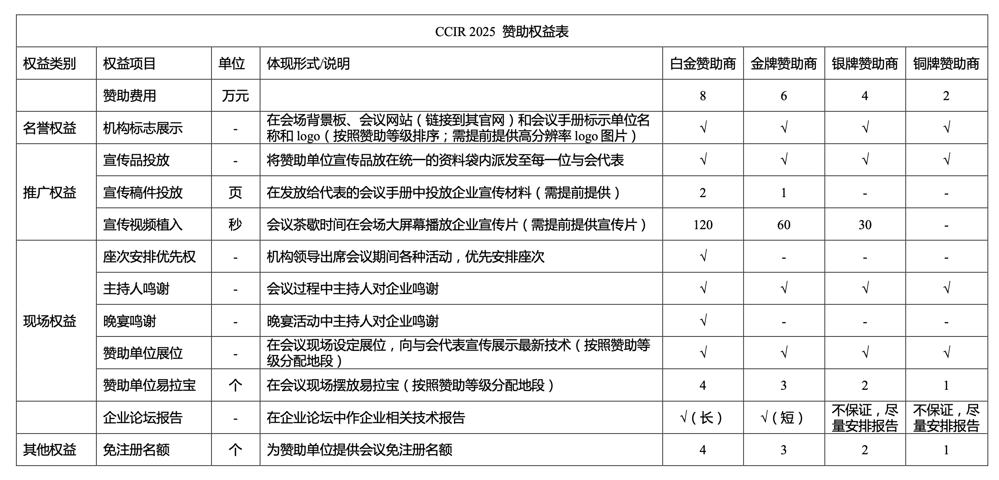

---
# TODO
title: 第三十一届全国信息检索学术会议赞助方案
# DONE
---









<!-- TODO -->

# <i class="fas fa-feather-alt"></i> 第三十一届全国信息检索学术会议赞助方案

## 1.会议基本信息

信息检索旨在满足人类在互联网上快速准确地获取信息与知识的需求，研究成果将支撑国家战略决策，推动互联网和人工智能领域的发展，提升整个社会的生产效率，并对社会生活各个领域产生重大影响。全国信息检索学术会议（CCIR）由中国中文信息学会（CIPS）举办，一路伴随着中国互联网产业的成长，是信息检索领域的旗舰会议。

第三十一届全国信息检索学术会议（The 31th China Conference on Information Retrieval, CCIR 2025）预计将于 2025 年 8 月 15-17 日在新疆石河子举行，会议以“信息检索 × 智能体：新范式与新机遇”为主题，聚焦信息检索与智能体的深度融合，建立信息获取、规划推理、群智协同与自主决策新范式。此次会议由中国中文信息学会主办，由中国中文信息学会信息检索专委会、新疆石河子大学承办。本届 CCIR 会议将包含一系列学术活动，除传统的海内外知名学者的大会报告、会议论文报告、Poster 交流、评测活动外，还将组织青年学者论坛以及面向热点研究问题的前沿讲习班等。大会也将邀请部分相关国际期刊与会议(如：TOIS / SIGIR / WWW / WSDM/ CIKM )的作者交流论文。

## 2.赞助权益

中国中文信息学会诚邀在行业内具有知名度和良好品牌效益的企业赞助支持 CCIR 2025，拟定的赞助权益如下。

如有其他特殊需求，请与赞助主席联系协调，最终安排以签订的赞助协议内容为准。

## 3.赞助手续

请与赞助联系人沟通确认后，共同联系中国中文信息学会签订赞助协议并完成拨款。

联系人：
马为之
电话：15201523158
电子邮箱：mawz@tsinghua.edu.cn

<a href="./assets/CCIR2025sponsor.pdf">点击下载</a>



