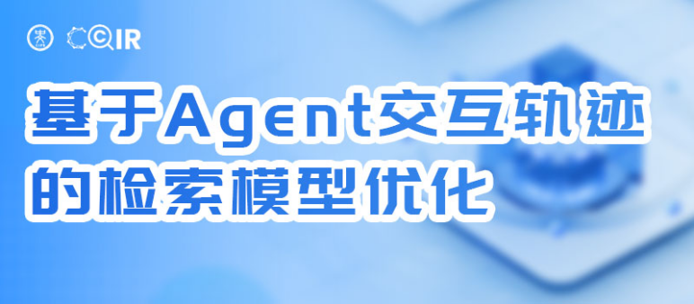
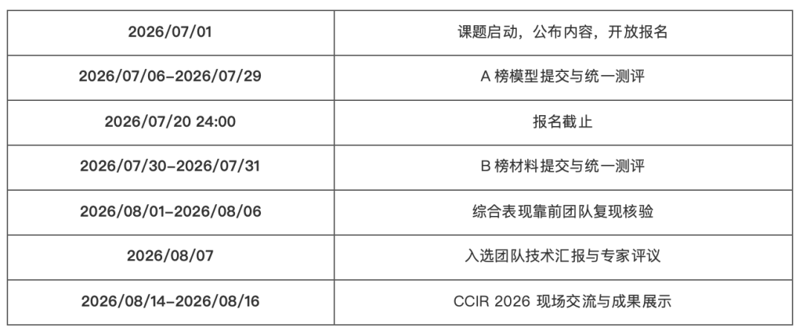
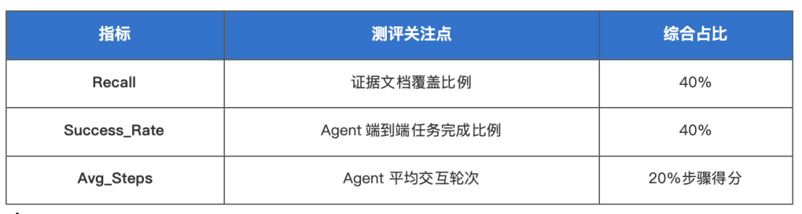
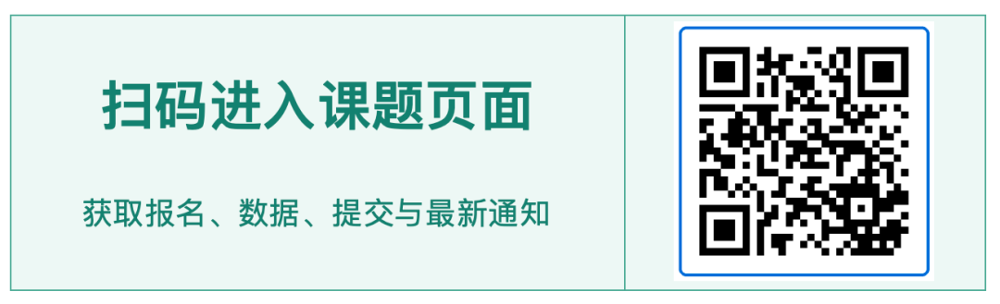









# <i class="fas fa-feather-alt"></i> CCIR CUP 2026 Agent轨迹检索器训练

CCIR Cup 是由全国信息检索学术会议（CCIR）发起的技术评测活动。全国信息检索学术会议由中国中文信息学会主办，长期关注信息检索领域的发展，推动互联网与人工智能技术创新。自2009年以来，CCIR持续组织系列技术评测，围绕真实问题探索解决方案，并为相关研究提供数据与交流支持。

## 01 课题介绍

本课题聚焦从大语言模型 Agent 的执行轨迹中训练检索器，探索如何利用多轮搜索、浏览和推理过程产生的信号，让检索模型更精准地服务于 Agent 的任务执行需求。课题周期约1个月，面向社会各界开放报名；团队规模为1-5人，提交内容将经过统一测评与复现核验。

**你负责训练，我们提供统一测评支持**：A榜阶段，参与团队按要求提交训练后的检索器模型，课题组将统一加载模型，完成 BC-Plus 检索、Agent 端到端运行与指标计算，并提供结果反馈；后续复现核验也由课题组统一组织。

研究基础来自论文《Learning to Retrieve from Agent Trajectories》。论文指出，传统检索器主要从人类点击和停留行为中学习，而 Agent 会围绕中间推理目标反复经历"搜索—浏览—推理—再搜索"。这种使用方式的变化，也要求检索器重新理解文档对任务进展的真实价值。

## 02 技术方向

**课题背景：** 随着大语言模型快速发展，Agent 已广泛应用于信息检索、代码生成和工具调用等复杂任务。Agent 通常需要从外部知识库持续获取证据，但现有检索器多基于通用语义相似度或人类交互日志训练，与 Agent 的查询和浏览模式存在明显差异。浏览动作、未浏览结果以及浏览后的推理痕迹，都可能成为新的检索监督信号。

**课题任务：** 参与团队需要使用官方提供的 Agent 轨迹与离线语料库，对 Qwen3-Embedding-0.6B 检索器进行训练，并在 BC-Plus 基准上观察其实际表现。重点需要解决以下问题：

- 如何从多轮 Agent 轨迹中识别高质量正样本和负样本。
- 如何在有限轨迹规模下充分挖掘监督信息，并估计文档对后续推理的效用强度。
- 如何让离线检索优化转化为 Agent 端到端任务完成能力和执行效率的提升。
- 如何避免过度适配单一 Agent，并获得对不同 Agent 模型的泛化能力。

**数据边界：** 仅可使用官方 LRAT Agent 轨迹、离线语料库及 Qwen3-Embedding-0.6B 原始权重。不得引入其他检索数据集、额外训练语料、其他模型参数或外部生成数据。

## 03 日程安排

本次技术评测周期约1个月，主要安排如下：

注：课题页部分文字存在年份或提交口径差异，本稿已按2026年整体日程统一整理；后续如有更新，以息壤平台最新通知为准。

## 04 测评指标

统一设置同时关注检索效果、Agent 任务完成情况和执行效率。A榜使用 Qwen3.5-4B 作为 Agent 模型，B榜更换不同 Agent 模型，以观察检索器的泛化能力。

**综合得分 = 0.4 × Recall + 0.4 × Success_Rate + 0.2 × Step_Score**；其中 Step_Score = 1 − Avg_Steps / 50。

## 05 参与方式

课题面向高校、科研院所、企业及社会各界开放，不限年龄与国籍。每队1-5人，成员需完成实名认证与团队信息登记。参与者可专注于轨迹信号挖掘和检索器训练，按阶段要求提交模型或复现材料；统一端到端测评、指标计算与复现核验由课题组组织开展。

**课题组提供的支持：**
- 统一加载各团队提交的检索器模型，并运行 BC-Plus 检索流程。
- 统一运行 Agent 端到端任务，计算 Recall、Success_Rate 与 Avg_Steps 等指标。
- 提供阶段性结果反馈，并对综合表现靠前团队组织复现核验。

无需自行准备完整的 Agent 端到端测评环境，团队可以把主要精力放在轨迹信号挖掘、样本构造和检索器训练上。

主办单位：中国中文信息学会 ｜ 承办单位：中国中文信息学会信息检索专业委员会 ｜ 官方平台：息壤平台




