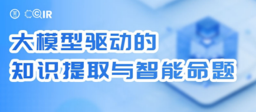
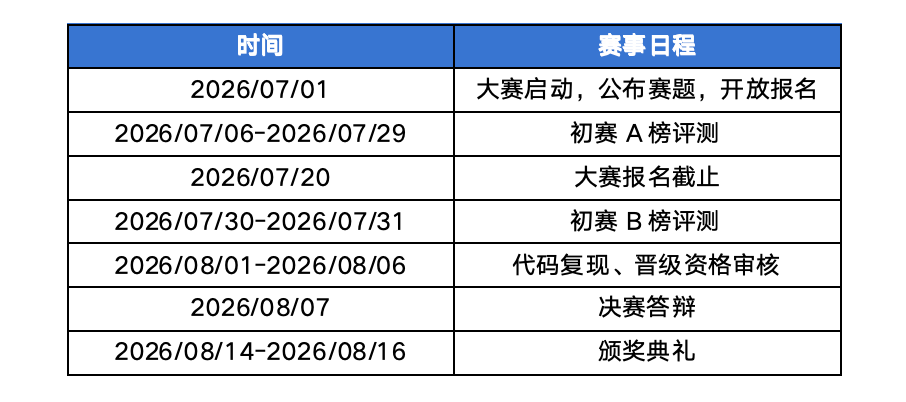
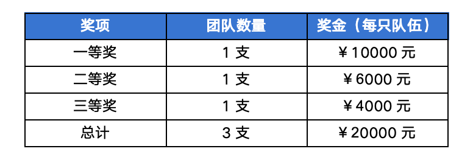









# <i class="fas fa-feather-alt"></i> 2026全国信息检索挑战杯 CCIR Cup 等你来战！

全国信息检索挑战杯（CCIR Cup）是由全国信息检索学术会议（CCIR）发起的技术评测比赛。

全国信息检索学术会议（CCIR）由中国中文信息学会主办，一路伴随着中国互联网产业的成长，迄今已成功举办三十一届，是信息检索领域的旗舰会议。CCIR 旨在推动信息检索领域的发展，满足人类在互联网上快速准确地获取信息与知识的需求，支撑国家战略决策，推动互联网和人工智能领域的发展。CCIR 从 2009 年起，开始组织系列评测比赛，致力于围绕实际问题探索解决方案，并为信息检索领域科研人员提供必需的研究数据支持。

## 01 赛事介绍

本次赛事聚焦大模型深度语义理解、知识结构化转化、标准化命题等核心能力，期望进一步促进大模型知识提取与智能命题方向的技术创新，为广大参赛者提供高水平竞技平台。赛程为期1个月，将于8月14-8月16日 CCIR 大会上决出最终优胜队伍。

目前赛事已向全社会开放报名，参赛团队不受年龄及国籍限制，诚邀各界积极参赛，奖金丰厚，快来挑战！

## 02 赛道简介

**赛道背景：** 从非结构化文本中精确提取知识、构建高质量题目，是构建知识图谱、驱动智能评估的重要技术方向。传统的知识点梳理与命题工作高度依赖人工，效率低下、标准不一，已成为制约知识服务规模化及模型评测体系建设的突出瓶颈。

大模型为文本的自动化知识点提取与智能命题开辟了技术新路径，但在实际应用中挑战依然严峻：文本信息稀疏、上下文有限，模型易产生幻觉、冗余和层级混淆；自动命题则常出现题型单一、逻辑矛盾及超纲等问题，且批量生成时一致性与稳定性难以保障。

因此，探索面向文本的高精度、高鲁棒、标准化的大模型知识提取与智能命题方法，不仅能显著提升知识提取效率，也将为智慧教育命题、高质量评测数据集构建提供关键技术支撑，具有重要的理论和产业应用价值。

**赛题任务：** 本赛题考察大模型对文本的深度理解、结构化知识点提取与标准化智能命题能力。参赛者需根据官方提供的训练数据，针对开源大模型进行训练和优化，提升知识点提取和命题能力，并完成以下两项任务：

- **知识点提取：** 对每套文本进行知识提纯与去噪，输出结构化知识点清单。知识点须精炼无冗余，均可溯源至原文，确保零错误，实现全量知识覆盖。
- **智能命题：** 基于原文与提取的知识点，为每套文本生成指定题型的题目（如单选题、多选题、判断题、简答题等），题目需覆盖文本全部知识点。每道题须附标准答案，确保逻辑严谨、表述清晰无歧义、不超纲。

## 03 赛程安排

本次 CCIR CUP 专题赛赛程约为1个月，赛程安排如下：

## 04 奖项设置

本赛题共提供奖金<strong>2万元</strong>，奖项设置如下：

## 05 参与方式

大赛面向社会各界开放，不限年龄、国籍，高校、科研院所、企业从业人员均可参赛，赶快点击以下链接报名吧！

<a href="https://www.xir.cn/competition/1169" target="_blank">https://www.xir.cn/competition/1169</a>




