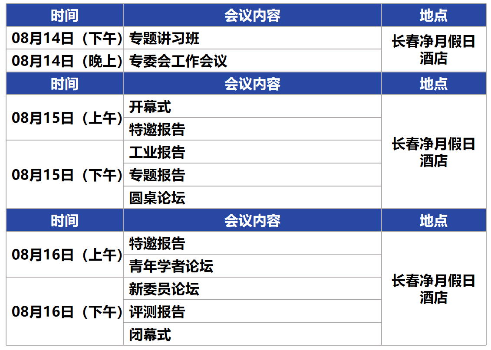
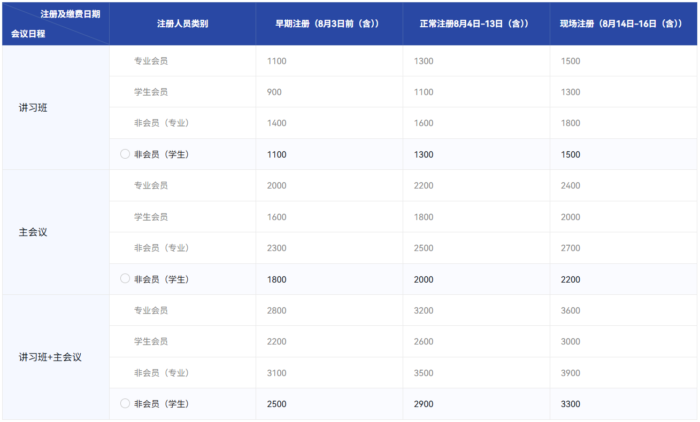
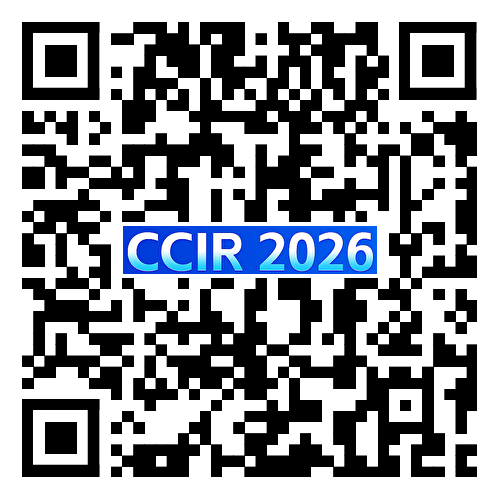
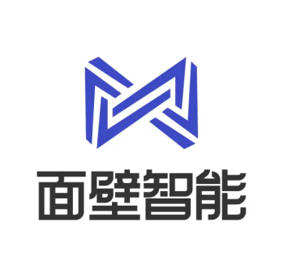
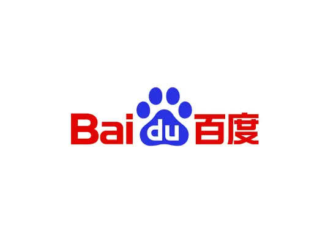









# <i class="fas fa-feather-alt"></i>会议注册

<h2 style="text-align:center;">全国信息检索学术会议CCIR2026开启注册！| 日程全公开</h2>

<h3>一、会议介绍</h3>

第三十二届全国信息检索学术会议（The 32th China Conference on Information Retrieval, CCIR 2026）将于<strong>2026年8月14-16日</strong>在<strong>吉林长春</strong>举行，此次会议由中国中文信息学会信息检索专委会主办，吉林大学承办。

本次大会的主题是"<strong>AI for Science: </strong>新范式与新未来"，聚焦<strong>科学信息检索与前沿科学研究</strong>的交叉融合，致力于构建海量知识检索、数据驱动、机理融合与智能发现的科研新范式。会议包含一系列学术活动，除传统的海内外知名学者的大会报告、会议论文报告外，还将组织青年学者论坛以及面向热点研究问题的讲习班等。CCIR已成为全国范围内信息检索领域新学术和技术工作的主要交流平台。

<h3>二、日程一览</h3>

注：会议具体报告名称及日程表见后续通知。

<h3>三、会议注册</h3>

会议早鸟注册通道开启！注册信息请访问<a href="https://www.cipsc.org.cn/Login.aspx?backurl=https://www.cipsc.org.cn/Learn/index.aspx?itemid=5394" target="_blank">会议注册网站</a>或扫描二维码进行注册。

<h3>四、会议地点</h3>

<strong>会议地点：长春净月假日酒店</strong>（长春市南关区净月开发区净月大街3070号）。<strong>会议住宿：</strong>长春净月假日酒店：双人间/大床房450元/晚

长春净月智选假日酒店：双人间/大床房350元/晚

地址：长春市南关区净月开发区净月大街3070号

酒店联系人：牟泉宇（13756478235）

<strong>会议交通：</strong>

<strong>长春站（北出口）</strong>

A 公共交通：步行至地铁1号线（约5分钟），乘坐1号线至卫星广场，站内换乘3号线，乘坐3号线至金河街站，出站后步行至会场，全程票价4元，时长约1小时。

B 网约车直达：全程约18公里，费用预计25-35元，约30分钟。

<strong>长春站（南出口）</strong>

A 公共交通：直接乘坐轻轨3号线至金河街站，出站后步行至会场，票价5元，时长约1小时。

B 网约车直达：全程约19公里，费用预计25-35元，约30分钟。

<strong>长春西站</strong>

A 公共交通：步行至地铁2号线（约5分钟），乘坐2号线至解放桥，站内换乘3号线，乘坐3号线至金河街站，出站后步行至会场，全程票价5元，时长约1小时10分钟。

B 网约车直达：全程约24公里，费用预计30-40元，约40分钟。

<strong>长春龙嘉机场</strong>

A 公共交通：步行至龙嘉机场巴士（约5分钟），乘坐巴士2号线至会展中心，转乘3号线至金河街，出站后步行至会场。巴士票价25元，3号线2元，全程时长约1.5小时。

B 网约车直达：全程34.5公里，费用预计80-100元，约45分钟。

<h3>大会赞助</h3>

  

    
    
<strong>金牌赞助</strong>

  

  

    
    
<strong>银牌赞助</strong>

  

<h3>联系方式</h3>

王鑫（13944926155，xinwang@jlu.edu.cn）

王琪（15643100507，qiwang@jlu.edu.cn）




